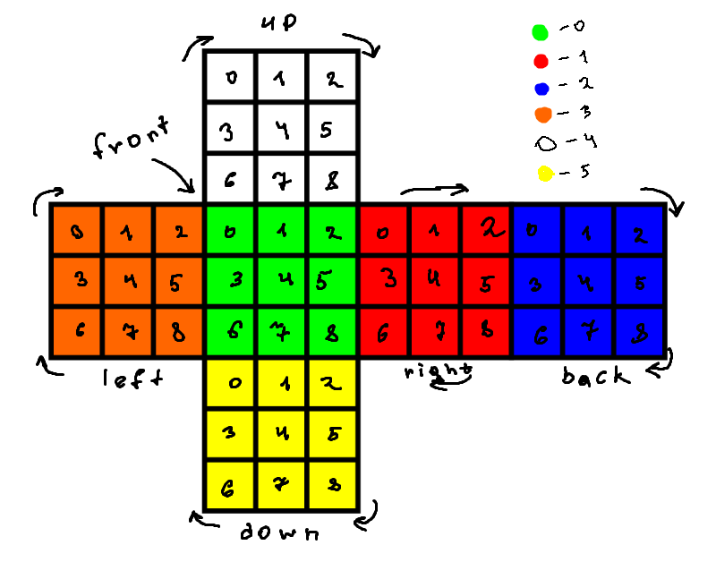

# rubicks-cube
C++ application, that performs this functions:
1. Make a random shuffle
2. Read/Write cube condition in .txt file
3. Solve Rubick's cube
4. Output rotations history in standard output flow
5. Output cube condition in standad uotput flow
6. Check is cube valid or not
\n Schema

